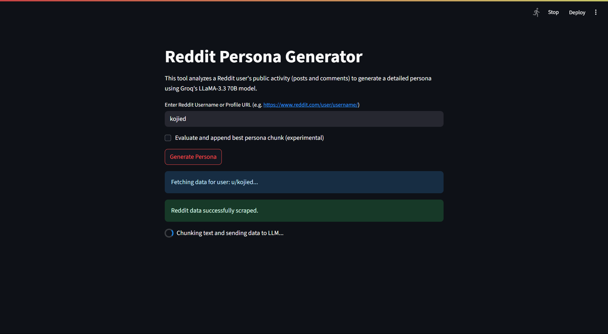
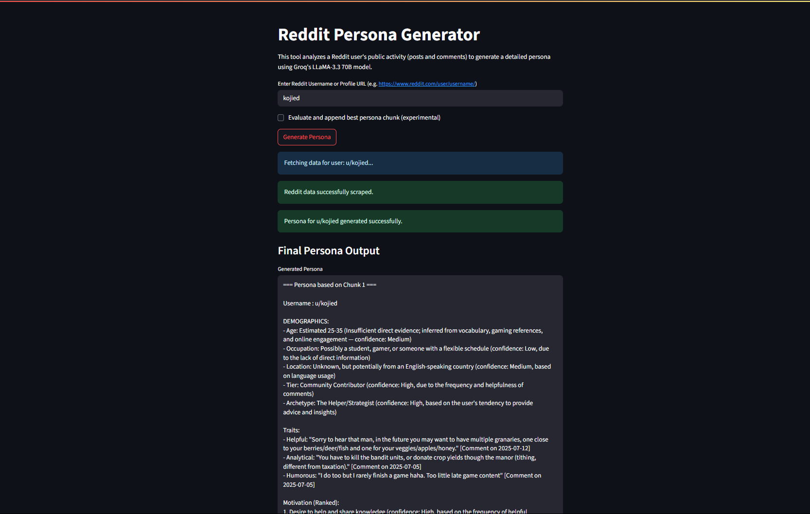

# Reddit-Persona
- This repository contains a Reddit profile scraper that builds user personas from posts and comments, using LLMs for analysis and summarization.

- This project generates detailed user personas by analyzing a Reddit user's public activity (comments and posts). The system combines Reddit data scraping using PRAW (Python Reddit API Wrapper) and structured persona synthesis using Groq's LLaMA 3.3 70B model. The result is a comprehensive, UX-focused persona document that includes behavioral insights, motivations, frustrations, and more.

---


## Table of Contents

- [Key Features](#key-features)
- [Demo: Streamlit Interface in Action](#demo-streamlit-interface-in-action)

- [1. Project Setup (Local Development)](#1-project-setup-local-development)
- [2. Running the Project with CLI (main.py)](#2-running-the-project-with-cli-mainpy)
- [3. Understanding the Persona Output](#3-understanding-the-persona-output)
- [4. Running the Project with UI (app.py)](#4-running-the-project-with-ui-apppy)
- [5. Chunk-Based Approach for LLM Inferencing](#5-chunk-based-approach-for-llm-inferencing)
- [6. Commented Code for Experimentation and Testing](#6-commented-code-for-experimentation-and-testing-during-development)
- [7. Togglable Under-Development Function](#7-togglable-under-development-function)
- [8. Project Structure and Workflow](#8-project-structure-and-workflow)
- [9. PRAW Setup and Reddit API Credentials](#9-praw-setup-and-reddit-api-credentials)
- [10. Groq Setup and API Key](#10-groq-setup-and-api-key)
- [11. Contribution](#11-contribution--license)
- [12. License](#12-license)
- [13. Contact](#13-contact)

##  Key Features

- **Persona Generation via LLM (LLaMA-3.3 70B by Groq)**  
  Extracts behavioral traits, motivations, MBTI-style personality, frustrations, and goals from Reddit content.

- **Streamlit UI for Non-Technical Users**  
   Not originally required in the assignment, but added as an enhancement: a clean, interactive web interface that allows users to input Reddit usernames, view structured personas, and download outputs — all without needing to use the terminal.

- **Chunk-Based LLM Inferencing**  
  Splits data into topic-consistent 2000-character blocks to better capture diverse behaviors and improve model output quality.

- **Raw + Formatted Output**  
  Outputs both the raw persona from the LLM and a cleaned, structured version. Also includes download support.

- **Timestamp-Aware Quote Labeling**  
  Reddit quotes retain optional timestamp context to improve traceability in the persona document.

- **Toggle for Under-Development Ranking Logic**  
  Optionally appends the most insight-rich chunk using `evaluate_and_append_best_persona()`.

- **Robust Input Handling**  
  Validates both raw usernames and full Reddit profile URLs; handles edge cases like deleted content gracefully.

- **Clean Codebase with Modular Structure**  
  Follows PEP-8, includes inline comments, and is split across logical modules (`scraper.py`, `llm_inferencer.py`, etc.)

---
---

## Demo: Streamlit Interface in Action

| Input & Loading | Final Persona Output |
|------------------|----------------------|
|  |  |

Above: Screenshots showing how the tool takes in a Reddit profile, scrapes posts/comments, and generates a clean, structured persona using Groq’s LLaMA model — all in a few seconds.

---

## 1. Project Setup (Local Development)

### Step 1: Clone the Repository

```
git clone https://github.com/AdityaSinghDevs/Reddit-Persona.git
```

- open the project in shell or a code editor like VS Code

### Step 2: Install Dependencies
Ensure you have Python 3.8+ installed.

```
pip install -r requirements.txt
```
- Using a Virtual environment like Conda or Python's venv is advised

### Step 3: Set Up Environment Variables
Create a .env file in the root directory using the provided .env.example as reference:

```
cp .env.example .env
```
Inside .env, fill in your Reddit and Groq API credentials:

```
GROQ_API_KEY=your_groq_api_key_here
CLIENT_ID=your_reddit_client_id
CLIENT_SECRET=your_reddit_client_secret
USER_AGENT=your_user_agent_string
```
Refer to section 8 below for guidance on generating Reddit API credentials and user agents.

## 2. Running the Project with CLI (main.py)

Use the terminal interface to generate a persona:

```
python main.py
```
You will be prompted to input a Reddit username or profile URL. The script will:

Scrape comments and posts using PRAW (More information about PRAW in section 8 )

Chunk the data for more accurate persona synthesis

Call Groq’s API to generate structured output

Format and save the persona into `sample_outputs/<username>_persona.txt`

## 3. Understanding the Persona Output
The final output consists of multiple persona blocks like:
```
=== Persona based on Chunk X ===
```
Each block is generated from a different chunk of the user's Reddit activity.

### Why Chunking?
Modern LLMs like LLaMA perform best when given contextually dense, focused inputs rather than extremely long documents. Reddit users often participate in many topics — from gaming to finance to philosophy — and mixing all those into a single block would dilute behavioral signals.

Instead, chunking allows the model to:

Focus on a consistent topic or behavioral mode per chunk

Capture micro-identities within a user’s activity (e.g., hobbyist, critic, explorer)

Maintain token limits for inference (each chunk is capped at ~2000 characters)

Produce multiple candidate personas that can be reviewed, compared, or fused

### NOTE : You can toggle [this](#6-togglable-under-development-function) function to see the most preffered persona in the end of text file

### What Is a Chunk?
A group of posts/comments combined into ~2000-character blocks

Created in chronological order

Filtered to remove deleted or empty text

### What Each Persona Block Contains:
- Demographics and archetype (e.g., The Analyst)

- Personality (MBTI-style with confidence)

- Traits, motivations, and behavior

- Frustrations and goals

- Supporting quotes from Reddit activity

You can view the full persona in `sample_outputs/<username>_persona.txt` or directly in the Streamlit UI.


## 4. Running the Project with UI (app.py)
The project includes a Streamlit-based interface that allows non-technical users to generate Reddit personas through a simple web interface.

To Launch the UI:
Ensure all dependencies are installed:

```
pip install -r requirements.txt
```

Run the app:

```
streamlit run app.py
```
Open the local URL displayed in the terminal.
If the browser doesn’t open automatically, copy the URL shown (e.g., http://localhost:8501) and open it manually.


Features of the Streamlit UI:
Input Support: Accepts either a Reddit username (kojied) or full profile URL (https://www.reddit.com/user/kojied/)

Automatic Validation: Extracts and validates the username from the URL internally

Real-Time Feedback: Displays loading indicators for:

- Reddit data scraping

- Text chunking and Groq LLM processing

Output Display:

- Shows the formatted persona directly in the app

- Includes a collapsible section for the raw LLM output

- Supports downloading the final persona as a .txt file

- Fully Integrated: The UI wraps around all backend logic (scraping, chunking, LLM inference, formatting)

## 5. Chunk-Based Approach for LLM Inferencing
This project uses a chunk-based inferencing method to ensure fidelity and richness in persona generation.

Due to the diversity of user interests on Reddit, each chunk of their activity may reflect different behavioral patterns or subcultural identities. By segmenting the user's data into chunks (each within 2000 characters), we send manageable and semantically dense blocks to the LLM. This helps:

Capture micro-behaviors that would otherwise be diluted in large context

Preserve topic separation between unrelated posts

Generate multiple persona drafts that reflect nuanced identity clusters

Each chunk yields a self-contained persona section, later reviewed for quality.

## 6. Commented Code for Experimentation and Testing during Development
Several blocks in main.py and llm_inferencer.py are commented out for optional testing and debugging:

Saving raw user data to <username>_data.txt

Writing raw LLM responses to <username>_persona_raw.txt

Intermediate print() statements in chunk processing and API calls

These were useful during development and can be re-enabled for experimental runs or troubleshooting.

## 7. Togglable Under-Development Function
The function ```evaluate_and_append_best_persona()``` in llm_inferencer.py compares persona chunks and appends a final summary of the most complete and insight-rich chunk to the output file.

This function is under-development and disabled by default with a toggle:

```
is_active = False  # Set to True to activate
```
When enabled, it helps choose the most informative persona and explains the reasoning.

## 8. Project Structure and Workflow
```
Reddit-Persona/
│
├── config.py                  # Loads credentials from .env
├── main.py                    # CLI entry point
├── app.py                     #  Streamlit UI entry point
├── scraper.py                 # Reddit data collection via PRAW
├── llm_inferencer.py          # Groq-based persona generation logic
├── formatter.py               # Cleans and saves output persona text
├── sample_outputs/            # Output directory for persona files
├── requirements.txt           # Python dependencies
├── .env.example               # Template for environment variables(rename to .env)
 Important: Add `.env` to your `.gitignore` to avoid exposing secrets in public repos.
└── README.md                  # Project documentation
```
### Workflow Overview
User Input: Provide Reddit username or profile URL

Scraping: scraper.py fetches comments and submissions

Chunking: llm_inferencer.py splits content into ~2000 character blocks

LLM Inference: Each chunk is sent to Groq for persona generation

Formatting: formatter.py cleans and removes duplications

Output: Saved in sample_outputs/username_persona.txt

(Optional): Evaluate best persona block using summarizer

## 9. PRAW Setup and Reddit API Credentials


### Reddit Account
A Reddit account is required. Create one at:
https://www.reddit.com/register

### What is PRAW?
PRAW (Python Reddit API Wrapper) is a Python library that provides a simple and intuitive interface for accessing Reddit’s RESTful API.

In this project, PRAW is used to:

- Authenticate with Reddit using OAuth2

- Retrieve a user’s recent comments and submissions

- Interact with Reddit’s data in a Pythonic way without directly handling HTTP requests

Key Features of PRAW:

- Easy access to Reddit user profiles, subreddits, and posts

- Automatically handles rate limits and pagination
 
- Highly readable and well-documented API surface.

Official Docs: https://praw.readthedocs.io

### Getting Reddit API Credentials
Go to https://www.reddit.com/prefs/apps

Click "Create App"

Select "script" type

Fill in:

- App name

- Redirect URI (use http://localhost:8080)

- Description (optional)

After creation, note your:

- Client ID (under the app name)
- Client Secret
- User Agent

You can also refer to this article I referred to : https://medium.com/@archanakkokate/scraping-reddit-data-using-python-and-praw-a-beginners-guide-7047962f5d29

And Official PRAW documentation :
https://praw.readthedocs.io/en/stable/getting_started/quick_start.html

## 10. Groq Setup and API Key
To access the LLaMA 3.3 70B model via Groq’s inference API, you need a Groq API key.

##  Why Groq?

Groq was chosen specifically for this assignment because it provides **extremely fast and scalable inference** for large language models like **LLaMA 3.3 70B** — ideal for generating multiple Reddit persona blocks in near real-time.

Unlike traditional providers, Groq’s ultra-low latency ensures that each chunk of Reddit content is processed swiftly, making the tool responsive even with long user histories.

For an academic-style persona generation system that relies on **multiple structured completions**, Groq offers the perfect balance of **speed, quality, and reliability**.


### Steps to Get a Groq API Key:
1. Go to https://console.groq.com

2. Sign up for a free account or log in

3. Navigate to the API Keys section in the left sidebar

4. Click “Generate API Key”

5. Give it a name (e.g. reddit-persona-project)

Copy the key and paste it into your .env file under:

```
GROQ_API_KEY=your_generated_groq_api_key
```
Notes:
- Your Groq key provides access to hosted models like llama-3-70b for high-performance, low-latency inference.

- You can switch or update the model being used via the model_name variable in llm_inferencer.py.

- Never share or commit your API key to public repositories. Keep it in .env and add .env to your .gitignore.

## 11. Contribution
This is a solo academic project submitted as part of an internship assignment.
For code suggestions or improvements, feel free to fork and submit a pull request.

## 12. License

This project is licensed under the [**CC BY-NC-ND 4.0 License**](LICENSE).

You are free to clone and run the project for evaluation purposes.  
Commercial use, redistribution, or modification is **not permitted without explicit permission**.

See full license details at [creativecommons.org](https://creativecommons.org/licenses/by-nc-nd/4.0/).


## 13. Contact
For questions, feel free to connect via GitHub or raise an issue in this repo.


